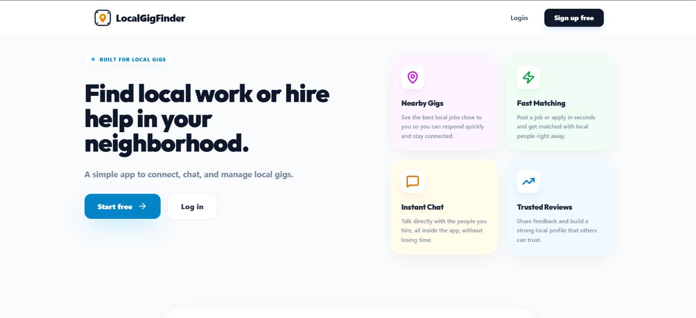
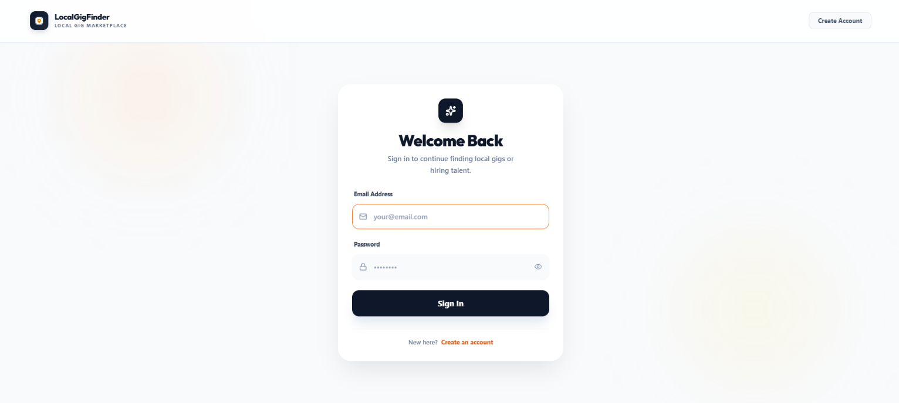
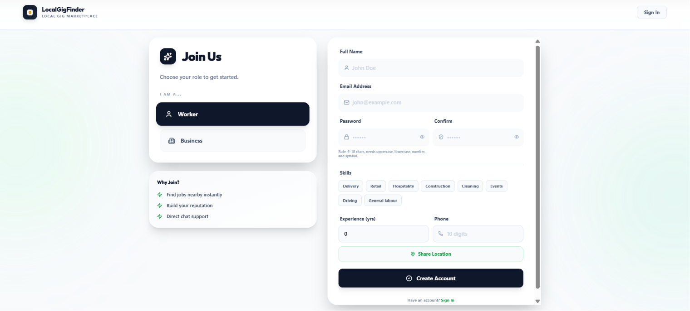
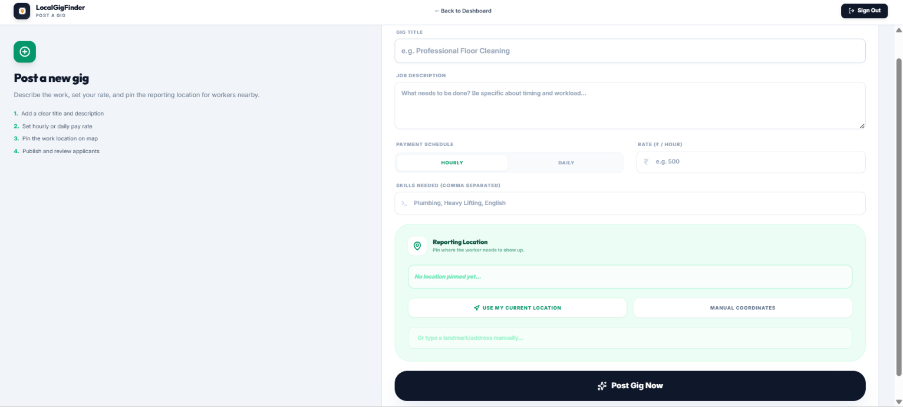
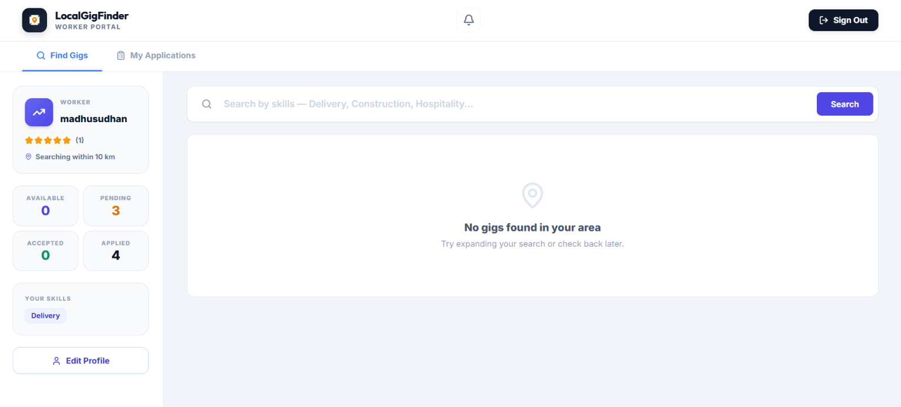
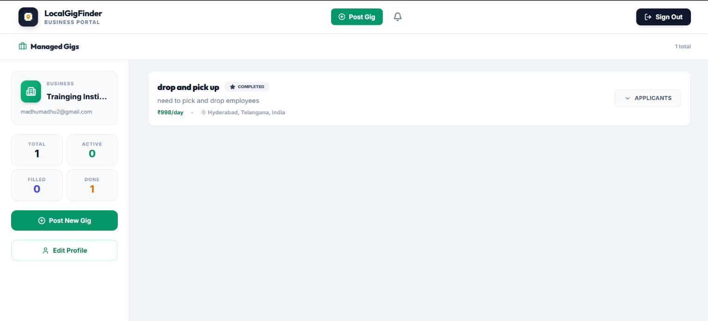

# 🚀 Local Gig Finder

A full-stack MERN application that connects local workers with businesses looking for short-term jobs, gigs, and services in their neighborhood.

---

## 📌 Features

✅ User Authentication (JWT)

✅ Worker & Business Accounts

✅ Role-Based Access Control

✅ Post and Manage Gigs

✅ Apply for Gigs

✅ Real-Time Chat System (Socket.io)

✅ Notifications System

✅ Admin Dashboard

✅ Responsive User Interface

✅ Secure Backend APIs

---

## 🛠️ Tech Stack

### Frontend

- React.js
- Vite
- Tailwind CSS
- Axios
- React Router DOM

### Backend

- Node.js
- Express.js
- MongoDB
- Mongoose
- JWT Authentication
- Socket.io

---

## 📂 Project Structure

```text
LOCAL-GIG-FINDER
│
├── backend
│   ├── config
│   ├── controllers
│   ├── middleware
│   ├── models
│   ├── routes
│   ├── sockets
│   ├── utils
│   └── server.js
│
├── frontend
│   ├── public
│   ├── src
│   └── vite.config.js
│
├── screenshots
│
├── package.json
├── README.md
└── .gitignore
```

---

## 📷 Screenshots

### 🏠 Home Page



---

### 🔐 Login Page



---

### 📝 Register Page



---

### 📢 Post Gig Page



---

### 👷 Worker Dashboard



---

### 🏢 Business Owner Dashboard



---

## ⚙️ Installation

### Clone Repository

```bash
git clone https://github.com/madhumadhu999888-sudo/LOCAL-GIG-FINDER.git
```

### Backend Setup

```bash
cd backend
npm install
npm run dev
```

### Frontend Setup

```bash
cd frontend
npm install
npm run dev
```

---

## 🔐 Environment Variables

Create a `.env` file inside the backend folder.

```env
MONGO_URI=your_mongodb_connection_string

JWT_SECRET=your_secret_key

PORT=5000
```

---

## 🚀 API Features

- User Registration
- User Login
- JWT Authentication
- Gig Creation
- Gig Applications
- Real-Time Messaging
- Notifications
- Admin Controls

---

## 📈 Future Enhancements

- 💳 Online Payments
- ⭐ Reviews & Ratings
- 📍 Advanced Location Search
- 📱 Mobile Application
- 🤖 AI-Based Worker Recommendations
- 📊 Analytics Dashboard

---

## 👨‍💻 Author

**Madhusudhan**

GitHub:

https://github.com/madhumadhu999888-sudo

---

## 🌟 Support

If you like this project, please give it a ⭐ on GitHub.

It helps others discover the project and supports future development.

---

## 📄 License

This project is created for educational and portfolio purposes.
